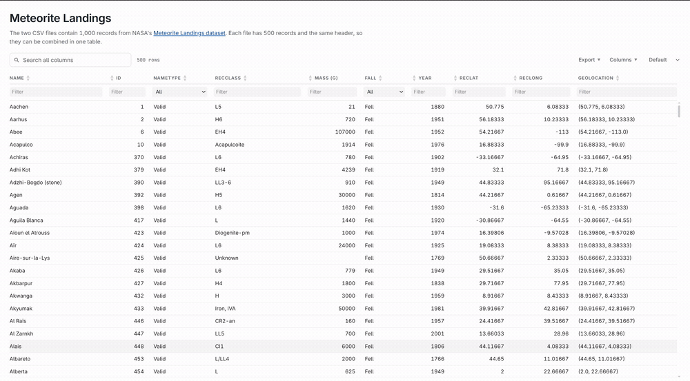

# CSVtoTable

CSVtoTable converts CSV files into interactive HTML tables.

- Single native binary with embedded frontend assets
- Standalone HTML output that works offline
- Local files, URLs, standard input, gzip archives, and multi-file input
- Mobile-responsive table layout
- Search, per-column filters, sorting, pagination, and virtual scrolling
- Copy, CSV, JSON, and print exports, plus column show/hide
- User-controlled light and dark themes



## Usage

```sh
# Write a standalone page
csvtotable sample/meteorite-landings-1.csv meteorites.html

# Combine files with the same columns
csvtotable sample/meteorite-landings-1.csv sample/meteorite-landings-2.csv meteorites.html

# Read a gzip-compressed file
csvtotable data.csv.gz data.html

# Fetch CSV directly from a URL
csvtotable https://raw.githubusercontent.com/vividvilla/csvtotable/master/sample/meteorite-landings-1.csv meteorites.html

# Open a temporary page in the default browser
csvtotable data.csv --serve

# Add a title and generate headers for headerless data
csvtotable data.csv data.html --title "Sales" --no-header

# Read stdin and write stdout
curl -L https://example.com/data.csv | csvtotable - - > data.html
```

Inputs may be local files, `http://` or `https://` URLs, or `-` for standard
input. When combining inputs, their headers and row widths must match. With
`--no-header`, generated column names are used and row widths must still match.
The final positional argument is the output file unless `--serve` is used.

Gzip-compressed input is unpacked automatically, and so is BOM-marked UTF-8 and
UTF-16 input. Use `--encoding` for other encodings, and `--delimiter` or
`--quotechar` for custom CSV formats.

Each column gets a filter below the table: a dropdown for columns with few
distinct values, a text box otherwise. Use `--no-column-filters` to hide the
row. The toolbar holds the export buttons and a column show/hide menu; pick a
subset with `--export-options`.

Run `csvtotable --help` for all options or `csvtotable --version` for the version.
For compatibility with version 2, `--pagination` and `--export` disable those
features.

## Install

### uvx, pipx, or pip

Run without installing:

```sh
uvx csvtotable data.csv data.html
```

Or install it:

```sh
pipx install csvtotable
pip install csvtotable # or inside a virtual environment:
uv tool install csvtotable
```

### npx or npm

```sh
npx @vividvilla/csvtotable data.csv data.html
npm install --global @vividvilla/csvtotable # or install globally:
```

To run a particular published version:

```sh
uvx csvtotable@X.Y.Z data.csv data.html
npx @vividvilla/csvtotable@X.Y.Z data.csv data.html
```

### Homebrew

```sh
brew install vividvilla/tap/csvtotable
```

### Standalone binary

Download an archive from [GitHub Releases](https://github.com/vividvilla/csvtotable/releases),
verify it with `SHA256SUMS`, and place `csvtotable` (`csvtotable.exe` on Windows)
on your `PATH`.

Prebuilt binaries support Linux x86-64/ARM64, macOS 12+ x86-64/Apple Silicon,
and Windows 10+ x86-64.

## Development

Building requires Go 1.24+ and Bun. Distribution packaging also requires Python
and npm. `table/dist` is generated before the Go build and embedded in the final
binary.

```sh
nix develop  # optional development environment
make build   # frontend and build/csvtotable
make test    # frontend, formatting, vet, and tests
make dist    # binary and host-platform packages under dist/
```

```sh
./build/csvtotable sample/meteorite-landings-1.csv sample/meteorite-landings-2.csv /tmp/meteorites.html
```

## License

MIT
